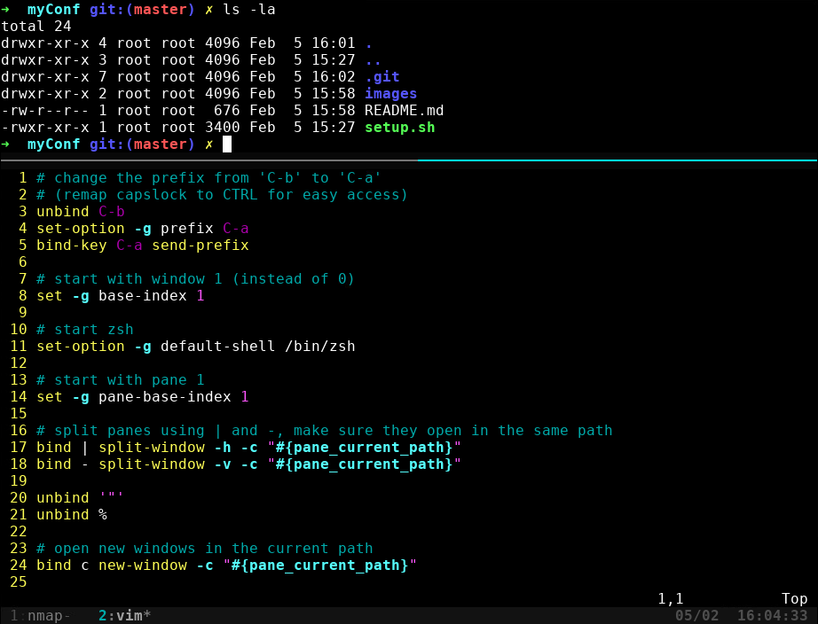

## myConf

This is just my configuration for a new linux setup.

### What it does?

##### Installs and Configures
- zsh (Oh My ZSH)
- TMUX
- Vim

##### ZSH
- Install zsh and make it the default shell
- Add autosuggestions plugin

##### TMUX configuration
- Enable Mouse
- Replace `ctrl+b` with `ctrl+a` as a trigger for commands
- Change Colours

*Extra shortcuts*

| Button | Action |
| :---: | --- |
| - | Split horizontally |
| &#124; | Split vertically |

List of tmux commands https://gist.github.com/henrik/1967800

Use you can `shift` while selecting text, to bypass the tmux clipboard.

##### Vim
- Enable numbering
- Change Colurschemes
- Set Syntax on

### Look

##### Notes
In case tmux does not load the conf, exit tmux, list all sessions and kill the previous sessions.
`tmux ls` and `tmux a`

<!--I love to keep notes for myself-->
